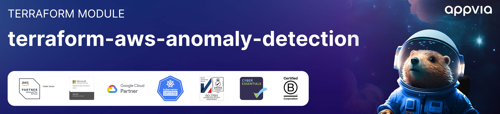

<!-- markdownlint-disable -->
<<<<<<< Updated upstream
<a href="https://www.appvia.io/"></a><br/><p align="right"> <a href="https://registry.terraform.io/modules/appvia/anomaly-detection/aws/latest"></a></a> <a href="https://github.com/appvia/terraform-aws-anomaly-detection/releases/latest"></a> <a href="https://appvia-community.slack.com/join/shared_invite/zt-1s7i7xy85-T155drryqU56emm09ojMVA#/shared-invite/email"></a> <a href="https://github.com/appvia/terraform-aws-anomaly-detection/graphs/contributors"></a>
=======

<a href="https://www.appvia.io/"></a><br/><p align="right"> <a href="https://registry.terraform.io/modules/appvia/anomaly-detection/aws/latest"></a></a> <a href="https://github.com/appvia/terraform-aws-anomaly-detection/releases/latest"></a> <a href="https://appvia-community.slack.com/join/shared_invite/zt-1s7i7xy85-T155drryqU56emm09ojMVA#/shared-invite/email"></a> <a href="https://github.com/appvia/terraform-aws-anomaly-detection/graphs/contributors"></a>
>>>>>>> Stashed changes

<!-- markdownlint-restore -->
<!--
  ***** CAUTION: DO NOT EDIT ABOVE THIS LINE ******
-->


# Terraform AWS Cost Anomaly Detection

## Description

The purpose of this module is convenience wrapper for provisioning one or more Cost Anomaly monitors and setting up the notifications for them.

## Usage

Add example usage here

```hcl
module "cost_anomaly_detection" {
  source = "../../"

  monitors      = local.monitors
  sns_topic_arn = var.sns_topic_arn
  tags          = var.tags
}
}
```

## Update Documentation

The `terraform-docs` utility is used to generate this README. Follow the below steps to update:

1. Make changes to the `.terraform-docs.yml` file
2. Fetch the `terraform-docs` binary (https://terraform-docs.io/user-guide/installation/)
3. Run `terraform-docs markdown table --output-file ${PWD}/README.md --output-mode inject .`

<!-- BEGIN_TF_DOCS -->
## Providers

| Name | Version |
|------|---------|
| <a name="provider_aws"></a> [aws](#provider\_aws) | >= 5.0.0 |

## Inputs

| Name | Description | Type | Default | Required |
|------|-------------|------|---------|:--------:|
| <a name="input_monitors"></a> [monitors](#input\_monitors) | A collection of cost anomaly monitors to create | <pre>list(object({<br/>    name = string<br/>    # The name of the monitor<br/>    monitor_type = optional(string, "DIMENSIONAL")<br/>    # The type of monitor to create<br/>    monitor_dimension = optional(string, "DIMENSIONAL")<br/>    # The dimension to monitor<br/>    monitor_specification = optional(string, null)<br/>    # The specification to monitor<br/>    notify = optional(object({<br/>      frequency = string<br/>      # The frequency of notifications<br/>      threshold_expression = optional(any, null)<br/>      # The threshold expression to use for notifications<br/>      }), {<br/>      frequency = "DAILY"<br/>    })<br/>  }))</pre> | n/a | yes |
| <a name="input_tags"></a> [tags](#input\_tags) | A map of tags to add to all resources | `map(string)` | n/a | yes |
| <a name="input_sns_topic_arn"></a> [sns\_topic\_arn](#input\_sns\_topic\_arn) | The ARN of an existing SNS topic for notifications | `string` | `null` | no |

## Outputs

No outputs.
<!-- END_TF_DOCS -->
